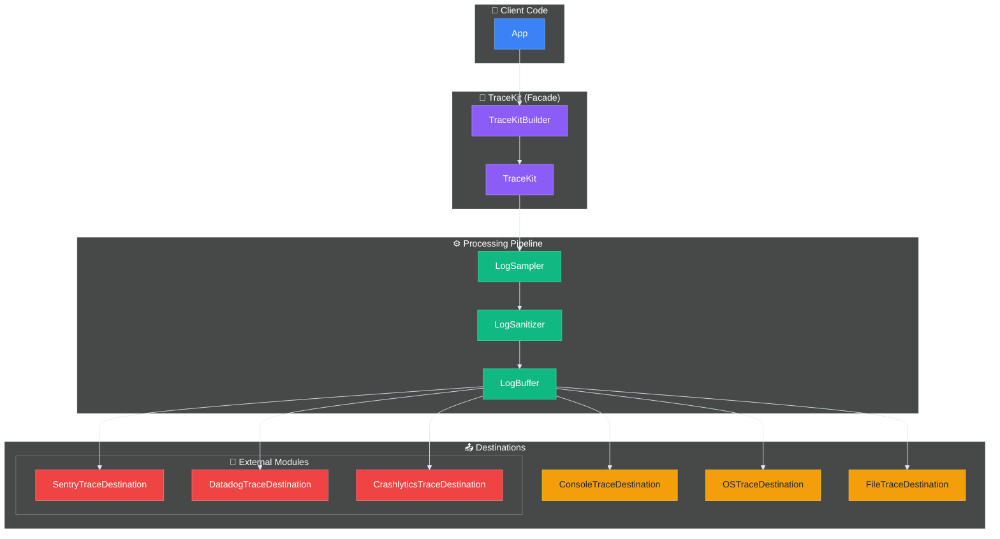
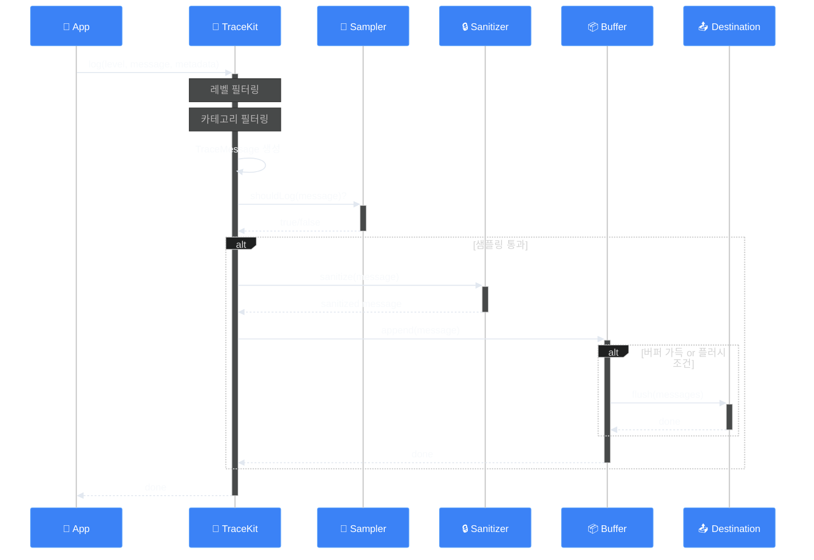
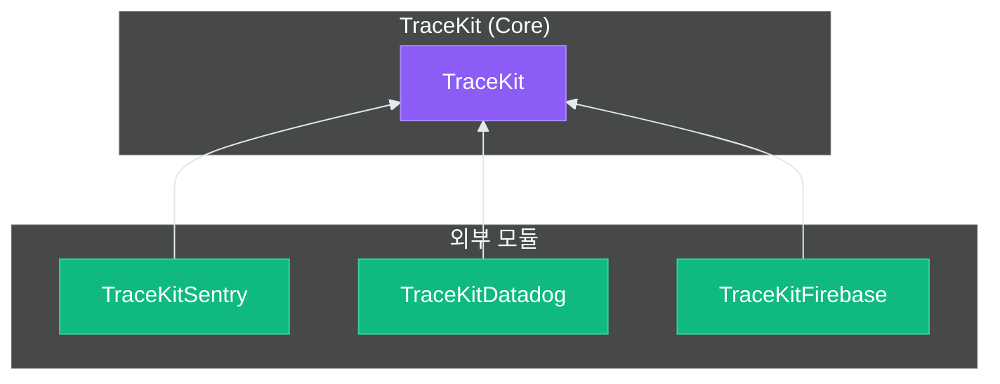

# 🏗️ 아키텍처

> 작성일: 2025-12-15
> 작성자: jimmy

## 개요

TraceKit는 Actor 기반의 스레드 안전한 로깅 시스템입니다. 파사드 패턴과 빌더 패턴을 활용하여 복잡한 내부 구현을 숨기고 쉬운 인터페이스를 제공합니다.

## 전체 구조



## 핵심 컴포넌트

### 1. TraceKit (파사드)

로깅 시스템의 진입점입니다. Singleton 패턴과 Actor를 결합하여 전역 접근성과 스레드 안전성을 동시에 제공합니다.

```
Projects/TraceKit/Sources/TraceKit.swift
```

주요 책임:
- 로그 메시지 수신
- 레벨/카테고리 필터링
- 파이프라인으로 전달
- 성능 추적 관리

API 유형:
- 동기 API: `TraceKit.info("...")` - await 없이 사용 (Fire-and-Forget)
- 비동기 API: `await TraceKit.shared.info("...")` - 완료 대기 가능

### 2. TraceKitBuilder (빌더)

복잡한 TraceKit 설정을 단순화합니다.

```
Projects/TraceKit/Sources/TraceKitBuilder.swift
```

체이닝 메서드:
- `addConsole()`, `addOSLog()`, `addFile()` - Destination 추가
- `withBuffer()`, `withSampling()` - 정책 설정
- `withDefaultSanitizer()` - 마스킹 활성화
- `build()`, `buildAsShared()` - 빌드

### 3. TraceDestination (프로토콜)

모든 출력 대상이 구현해야 하는 프로토콜입니다.

```
Projects/TraceKit/Sources/Core/TraceDestination.swift
```

```swift
public protocol TraceDestination: Actor {
    var identifier: String { get }
    var minLevel: TraceLevel { get set }
    var isEnabled: Bool { get set }
    func log(_ message: TraceMessage) async
    func flush(_ messages: [TraceMessage]) async
}
```

### 4. TraceMessage (값 객체)

로그 정보를 담는 불변 구조체입니다.

```
Projects/TraceKit/Sources/Core/TraceMessage.swift
```

포함 정보:
- `id`: 고유 식별자 (UUID)
- `level`: 로그 레벨
- `message`: 메시지 본문
- `category`: 카테고리 (예: "Network", "Auth")
- `metadata`: 추가 데이터
- `userContext`: 사용자 컨텍스트
- `timestamp`: 발생 시간
- `file`, `function`, `line`: 호출 위치

## 데이터 흐름



## 폴더 구조

```
Projects/TraceKit/Sources/
├── TraceKit.swift              # 메인 TraceKit 클래스
├── TraceKitActor.swift         # @TraceKitActor 정의
├── TraceKitBuilder.swift       # 빌더
│
├── Core/                     # 핵심 타입
│   ├── TraceLevel.swift        # 로그 레벨 enum
│   ├── TraceMessage.swift      # 로그 메시지 값 객체
│   ├── TraceDestination.swift  # Destination 프로토콜
│   ├── LogFormatter.swift    # Formatter 프로토콜
│   ├── LogSanitizer.swift    # Sanitizer 프로토콜
│   ├── UserContext.swift     # 사용자 컨텍스트
│   └── Policies/             # 정책 정의
│       ├── LogBufferPolicy.swift
│       ├── SamplingPolicy.swift
│       └── LogFileRetentionPolicy.swift
│
├── Configuration/            # 설정
│   ├── TraceKitConfiguration.swift
│   └── LaunchArgumentParser.swift
│
├── Destinations/             # 출력 대상 구현
│   ├── ConsoleTraceDestination.swift
│   ├── OSTraceDestination.swift
│   └── FileTraceDestination.swift
│
├── Formatters/               # 포맷터 구현
│   ├── PrettyLogFormatter.swift
│   └── JSONLogFormatter.swift
│
├── Buffer/                   # 버퍼링
│   ├── LogBuffer.swift
│   └── RingBuffer.swift
│
├── Sampling/                 # 샘플링
│   └── LogSampler.swift
│
├── Sanitizers/               # 민감정보 처리
│   └── DefaultLogSanitizer.swift
│
├── Context/                  # 컨텍스트
│   └── DefaultUserContextProvider.swift
│
├── Crash/                    # 크래시 로그
│   └── CrashLogPreserver.swift
│
├── File/                     # 파일 관리
│   └── LogFileManager.swift
│
└── Performance/              # 성능 추적
    └── PerformanceTracer.swift
```

## Actor 격리

### @TraceKitActor

TraceKit 전용 Actor로, 모든 TraceKit 관련 작업이 동일한 격리 컨텍스트에서 실행됩니다.

```swift
@globalActor
public actor TraceKitActor {
    public static let shared = TraceKitActor()
}
```

### Destination Actor

각 Destination은 독립적인 Actor로, 병렬 출력이 가능합니다:

```swift
public actor ConsoleTraceDestination: TraceDestination {
    // Actor 내부에서 스레드 안전하게 처리
}
```

## 확장 포인트

### 커스텀 Destination 추가

```swift
public actor MyCustomDestination: TraceDestination {
    public let identifier = "custom"
    public var minLevel: TraceLevel = .info
    public var isEnabled: Bool = true
    
    public func log(_ message: TraceMessage) async {
        // 커스텀 로직
    }
}
```

### 커스텀 Formatter 추가

```swift
public struct MyFormatter: LogFormatter {
    public func format(_ message: TraceMessage) -> String {
        // 커스텀 포맷
    }
}
```

### 커스텀 Sanitizer 추가

```swift
public struct MySecuritySanitizer: LogSanitizer {
    public var isEnabled: Bool = true
    
    public func sanitize(_ message: TraceMessage) -> TraceMessage {
        // 커스텀 마스킹 로직
    }
}
```

## 의존성 규칙



- Core TraceKit는 외부 의존성이 없습니다
- 외부 연동 모듈은 Core TraceKit에만 의존합니다
- 외부 SDK 의존성은 각 모듈에서만 관리합니다

## 다음 단계

- [사용법](./03-사용법.md) - 실제 사용 예제
- [고급 기능](./04-고급-기능.md) - 버퍼링, 샘플링 상세

