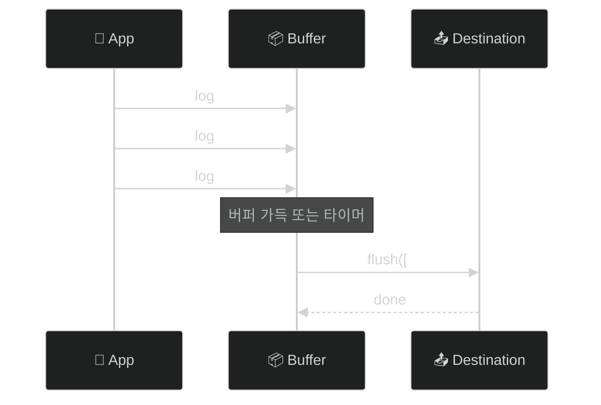

# ⚙️ 고급 기능

> 작성일: 2025-12-15
> 작성자: jimmy

> 💡 이 문서의 예제에서 일반 로깅은 동기 API(`Logger.info(...)`)를 사용하고,
> 성능 추적(span), flush 등 결과가 필요한 경우만 비동기 API(`await Logger.shared...`)를 사용합니다.

## 로그 버퍼링

### 개요

버퍼링은 로그 메시지를 모아서 한 번에 처리하여 I/O 오버헤드를 줄입니다.



### LogBufferPolicy

```swift
public struct LogBufferPolicy {
    let maxSize: Int              // 최대 버퍼 크기
    let flushInterval: TimeInterval  // 자동 플러시 간격
    let flushOnLevel: LogLevel?   // 이 레벨 이상이면 즉시 플러시
    let flushOnBackground: Bool   // 백그라운드 진입 시 플러시
}
```

### 프리셋

```swift
// 기본 정책
LogBufferPolicy.default
// maxSize: 100, flushInterval: 5초, flushOnLevel: .error

// 실시간 (버퍼링 없음)
LogBufferPolicy.realtime
// maxSize: 1, flushInterval: 0

// 배터리 절약
LogBufferPolicy.batterySaver
// maxSize: 200, flushInterval: 30초
```

### 사용법

```swift
let logger = await LoggerBuilder()
    .addConsole()
    .withBuffer(policy: .default)
    .buildAsShared()

// 수동 플러시
Task {
    await Logger.shared.flush()
}
```

### 커스텀 정책

```swift
let customPolicy = LogBufferPolicy(
    maxSize: 50,
    flushInterval: 10.0,
    flushOnLevel: .warning,  // warning 이상은 즉시 플러시
    flushOnBackground: true
)

let logger = await LoggerBuilder()
    .withBuffer(policy: customPolicy)
    .buildAsShared()
```

## 로그 샘플링

### 개요

프로덕션 환경에서 로그 볼륨을 제어합니다. 모든 로그를 수집하면 비용이 증가하고 분석이 어려워집니다.

### SamplingPolicy

```swift
public struct SamplingPolicy {
    let defaultRate: Double           // 기본 비율 (0.0 ~ 1.0)
    let ratesByLevel: [LogLevel: Double]   // 레벨별 비율
    let ratesByCategory: [String: Double]  // 카테고리별 비율
    let alwaysIncludeLevels: Set<LogLevel> // 항상 포함할 레벨
}
```

### 프리셋

```swift
// 디버그용 (100% 수집)
SamplingPolicy.debug
// defaultRate: 1.0, alwaysIncludeLevels: 모든 레벨

// 프로덕션용
SamplingPolicy.production
// defaultRate: 0.1 (10%)
// verbose: 1%, debug: 5%, info: 10%, warning: 50%
// error, fatal: 100%

// 최소 샘플링
SamplingPolicy.minimal
// defaultRate: 0.01 (1%)
// error, fatal: 100%
```

### 사용법

```swift
let logger = await LoggerBuilder()
    .addConsole()
    .withSampling(policy: .production)
    .buildAsShared()
```

### 커스텀 정책

```swift
let customPolicy = SamplingPolicy(
    defaultRate: 0.2,  // 기본 20%
    ratesByLevel: [
        .verbose: 0.0,   // verbose는 수집하지 않음
        .debug: 0.05,    // debug는 5%
        .warning: 1.0    // warning은 100%
    ],
    ratesByCategory: [
        "Network": 0.5,  // Network 카테고리는 50%
        "Auth": 1.0      // Auth 카테고리는 100%
    ],
    alwaysIncludeLevels: [.error, .fatal]
)
```

### 샘플링 동작 원리

```swift
// 1. alwaysIncludeLevels에 있으면 100%
if alwaysIncludeLevels.contains(message.level) {
    return 1.0
}

// 2. 레벨별 비율이 있으면 우선
if let levelRate = ratesByLevel[message.level] {
    return levelRate
}

// 3. 카테고리별 비율이 있으면 사용
if let categoryRate = ratesByCategory[message.category] {
    return categoryRate
}

// 4. 기본 비율
return defaultRate
```

## 민감정보 마스킹

### 개요

로그에 포함될 수 있는 민감정보를 자동으로 마스킹합니다.

### 기본 패턴

| 패턴 | 예시 | 마스킹 결과 |
|-----|------|-----------|
| 이메일 | `john@example.com` | `[EMAIL]` |
| 신용카드 | `1234-5678-9012-3456` | `[CREDIT_CARD]` |
| 전화번호 | `010-1234-5678` | `[PHONE]` |
| IP 주소 | `192.168.1.1` | `[IP_ADDRESS]` |
| JWT | `eyJhbGciOiJI...` | `[JWT_TOKEN]` |
| UUID | `550e8400-e29b-...` | `[UUID]` |
| 비밀번호 | `password=secret123` | `password=[MASKED]` |

### 사용법

```swift
// 기본 정제기 사용
let logger = await LoggerBuilder()
    .withDefaultSanitizer()
    .buildAsShared()

// 마스킹 동작 (동기 API 사용)
Logger.info("사용자 이메일: john@example.com")
// 출력: "사용자 이메일: [EMAIL]"
```

### 커스텀 패턴 추가

```swift
let customSanitizer = DefaultLogSanitizer.Builder()
    // 기본 패턴에 추가
    .add(try! SensitiveDataPattern(
        name: "Korean SSN",
        pattern: #"\d{6}-\d{7}"#,
        replacement: "[SSN]"
    ))
    .add(try! SensitiveDataPattern(
        name: "API Key",
        pattern: #"api[_-]?key[=:]\s*[\w-]+"#,
        replacement: "api_key=[REDACTED]"
    ))
    .build()

let logger = await LoggerBuilder()
    .withSanitizer(customSanitizer)
    .buildAsShared()
```

### 빈 패턴으로 시작

```swift
// 기본 패턴 없이 커스텀 패턴만 사용
let minimalSanitizer = DefaultLogSanitizer.Builder.empty()
    .add(try! SensitiveDataPattern(
        name: "Custom Secret",
        pattern: #"SECRET_\w+"#,
        replacement: "[SECRET]"
    ))
    .build()
```

### 마스킹 비활성화

```swift
// 설정에서 비활성화
let config = LoggerConfiguration(isSanitizingEnabled: false)

// 또는 정제기 자체를 비활성화
let disabledSanitizer = DefaultLogSanitizer(isEnabled: false)
```

## 성능 추적

### 개요

코드 실행 시간을 측정하고 로그로 기록합니다.

### 자동 측정 (measure)

```swift
// 함수 실행 시간 자동 측정
let result = await Logger.shared.measure(name: "데이터 로딩") {
    await loadData()
}

// 출력 예시:
// [PERF] 데이터 로딩: 1.234s
```

### 수동 측정 (Span)

```swift
// 시작
let spanId = await Logger.shared.startSpan(name: "복잡한 작업")

// ... 작업 수행 ...

// 종료 (메타데이터 추가 가능)
await Logger.shared.endSpan(
    id: spanId,
    metadata: ["itemCount": AnyCodable(100)]
)
```

### 중첩 Span

```swift
// 부모 Span
let parentId = await Logger.shared.startSpan(name: "전체 작업")

    // 자식 Span 1
    let child1Id = await Logger.shared.startSpan(
        name: "데이터 로딩",
        parentId: parentId
    )
    await loadData()
    await Logger.shared.endSpan(id: child1Id)
    
    // 자식 Span 2
    let child2Id = await Logger.shared.startSpan(
        name: "데이터 처리",
        parentId: parentId
    )
    await processData()
    await Logger.shared.endSpan(id: child2Id)

// 부모 종료
await Logger.shared.endSpan(id: parentId)
```

### 실전 예제: API 호출 추적

```swift
actor NetworkService {
    func fetchUser(id: String) async throws -> User {
        let spanId = await Logger.shared.startSpan(name: "fetchUser")
        
        defer {
            Task {
                await Logger.shared.endSpan(id: spanId)
            }
        }
        
        // 네트워크 요청
        let requestSpan = await Logger.shared.startSpan(
            name: "HTTP Request",
            parentId: spanId
        )
        let (data, _) = try await urlSession.data(from: url)
        await Logger.shared.endSpan(id: requestSpan)
        
        // JSON 파싱
        let parseSpan = await Logger.shared.startSpan(
            name: "JSON Parsing",
            parentId: spanId
        )
        let user = try decoder.decode(User.self, from: data)
        await Logger.shared.endSpan(id: parseSpan)
        
        return user
    }
}
```

## 크래시 로그 보존

### 개요

앱 크래시 직전의 로그를 파일에 보존하여 크래시 원인 분석에 활용합니다.

### 사용법

```swift
let logger = await LoggerBuilder()
    .addConsole()
    .withCrashPreservation(count: 50)  // 최근 50개 로그 보존
    .buildAsShared()
```

### 크래시 후 로그 복구

```swift
// 다음 앱 실행 시
Task {
    if let crashLogs = await Logger.shared.recoverCrashLogs() {
        for log in crashLogs {
            print("크래시 전 로그: \(log)")
        }
        
        // 외부 서비스로 전송
        await analyticsService.sendCrashLogs(crashLogs)
        
        // 정리
        await Logger.shared.clearCrashLogs()
    }
}
```

## 사용자 컨텍스트

### 개요

모든 로그에 자동으로 사용자/앱 정보를 추가합니다.

### UserContext

```swift
public struct UserContext {
    let userId: String?
    let sessionId: String
    let appVersion: String
    let osVersion: String
    let deviceModel: String
    let environment: Environment
}
```

### 기본 컨텍스트 제공자

```swift
let logger = await LoggerBuilder()
    .withDefaultContextProvider(environment: .production)
    .buildAsShared()

// 로그 출력에 자동 포함 (동기 API 사용)
Logger.info("사용자 액션")
// metadata에 appVersion, osVersion, deviceModel 자동 추가
```

### 커스텀 컨텍스트 제공자

```swift
actor MyContextProvider: UserContextProvider {
    func currentContext() async -> UserContext {
        return UserContext(
            userId: await AuthManager.shared.currentUserId,
            sessionId: SessionManager.current.id,
            appVersion: Bundle.main.appVersion,
            osVersion: UIDevice.current.systemVersion,
            deviceModel: UIDevice.current.model,
            environment: .production
        )
    }
}

let logger = await LoggerBuilder()
    .withContextProvider(MyContextProvider())
    .buildAsShared()
```

## 파일 로그 관리

### LogFileRetentionPolicy

```swift
public struct LogFileRetentionPolicy {
    let maxFileSize: Int64     // 최대 파일 크기
    let maxFileCount: Int      // 최대 파일 개수
    let maxAge: TimeInterval   // 최대 보관 기간
}
```

### 프리셋

```swift
// 기본
LogFileRetentionPolicy.default
// 10MB, 5개, 7일

// 상세 보관
LogFileRetentionPolicy.detailed
// 50MB, 10개, 30일

// 최소 보관
LogFileRetentionPolicy.minimal
// 5MB, 3개, 3일
```

### 사용법

```swift
let logger = await LoggerBuilder()
    .addFile(
        minLevel: .info,
        retentionPolicy: LogFileRetentionPolicy(
            maxFileSize: 20 * 1024 * 1024,  // 20MB
            maxFileCount: 10,
            maxAge: 14 * 24 * 3600          // 14일
        )
    )
    .buildAsShared()
```

## 다음 단계

- [외부 연동](./05-외부-연동.md) - Sentry, Datadog, Firebase 연동
- [런타임 설정](./06-런타임-설정.md) - Launch Arguments

