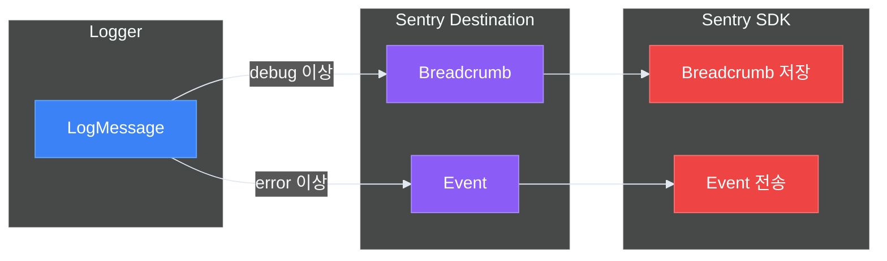
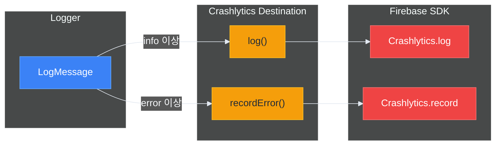

# 🔌 외부 연동

> 작성일: 2025-12-15
> 작성자: jimmy

## 개요

Logger는 외부 모니터링/분석 서비스와 연동하기 위한 별도 모듈을 제공합니다.

> 💡 외부 서비스 연동 후에도 동기 API(`Logger.error(...)`)로 간편하게 로깅할 수 있습니다.
> 내부적으로 Fire-and-Forget 패턴으로 처리됩니다.

| 모듈 | 서비스 | 용도 |
|-----|-------|------|
| LoggerSentry | Sentry | 에러 모니터링, 이슈 추적 |
| LoggerDatadog | Datadog | 로그 분석, 메트릭 |
| LoggerFirebase | Firebase Crashlytics | 크래시 리포팅 |

## 모듈 설치

### Tuist 설정

```swift
// Workspace.swift
let workspace = Workspace(
    name: "MyApp",
    projects: [
        "Projects/MyApp",
        "Projects/Logger",
        "Projects/LoggerSentry",     // Sentry 사용 시
        "Projects/LoggerDatadog",    // Datadog 사용 시
        "Projects/LoggerFirebase"    // Firebase 사용 시
    ]
)

// Project.swift (MyApp)
let project = Project(
    name: "MyApp",
    targets: [
        .target(
            name: "MyApp",
            dependencies: [
                .project(target: "Logger", path: "../Logger"),
                .project(target: "LoggerSentry", path: "../LoggerSentry"),
                // ...
            ]
        )
    ]
)
```

## Sentry 연동

### 설치

1. Sentry SDK 추가 (SPM)
2. LoggerSentry 모듈 활성화

### 초기화

```swift
import Logger
import LoggerSentry

@main
struct MyApp: App {
    init() {
        Task {
            await setupLogger()
        }
    }
    
    @LoggerActor
    func setupLogger() async {
        let sentryDestination = SentryLogDestination(
            dsn: "https://xxx@sentry.io/123",
            minLevel: .info,
            breadcrumbMinLevel: .debug,  // Breadcrumb에 debug 이상 기록
            eventMinLevel: .error,       // Event로는 error 이상만 전송
            environment: "production",
            debug: false
        )
        
        let logger = await LoggerBuilder()
            .addConsole()
            .addDestination(sentryDestination)
            .buildAsShared()
    }
}
```

### 동작 방식



| 레벨 | Breadcrumb | Event |
|-----|------------|-------|
| verbose | ❌ | ❌ |
| debug | ✅ | ❌ |
| info | ✅ | ❌ |
| warning | ✅ | ❌ |
| error | ✅ | ✅ |
| fatal | ✅ | ✅ |

### 사용자 정보 설정

```swift
Task {
    let sentryDest = await getSentryDestination()
    
    // 사용자 설정
    await sentryDest.setUser(
        id: "user123",
        email: "user@example.com",
        username: "John"
    )
    
    // 태그 추가
    await sentryDest.setTag(key: "plan", value: "premium")
    
    // 컨텍스트 추가
    await sentryDest.setContext(
        key: "feature_flags",
        value: ["newUI": true, "darkMode": true]
    )
}
```

### Sentry 레벨 매핑

| LogLevel | SentryLevel |
|----------|-------------|
| verbose, debug | .debug |
| info | .info |
| warning | .warning |
| error | .error |
| fatal | .fatal |

## Datadog 연동

### 설치

1. Datadog SDK 추가 (SPM)
2. LoggerDatadog 모듈 활성화

### 초기화

```swift
import Logger
import LoggerDatadog
import DatadogCore

@main
struct MyApp: App {
    init() {
        Task {
            await setupLogger()
        }
    }
    
    @LoggerActor
    func setupLogger() async {
        // Datadog SDK 초기화 (앱 시작 시 1회)
        Datadog.initialize(
            with: Datadog.Configuration(
                clientToken: "pub_xxx",
                env: "production",
                service: "my-ios-app"
            ),
            trackingConsent: .granted
        )
        
        let datadogDestination = DatadogLogDestination(
            clientToken: "pub_xxx",
            environment: "production",
            serviceName: "my-ios-app",
            minLevel: .info
        )
        
        let logger = await LoggerBuilder()
            .addConsole()
            .addDestination(datadogDestination)
            .buildAsShared()
    }
}
```

### 로그 구조

Datadog으로 전송되는 로그 구조:

```json
{
  "message": "사용자 로그인 성공",
  "status": "info",
  "service": "my-ios-app",
  "attributes": {
    "category": "Auth",
    "file": "AuthManager.swift",
    "function": "login()",
    "line": 42,
    "userId": "user123",
    "sessionId": "sess_abc",
    "appVersion": "1.0.0",
    "osVersion": "17.0",
    "deviceModel": "iPhone15,2"
  }
}
```

### 전역 속성/태그 관리

```swift
Task {
    let datadogDest = await getDatadogDestination()
    
    // 전역 속성 추가
    await datadogDest.addAttribute(key: "userId", value: "user123")
    await datadogDest.addAttribute(key: "plan", value: "premium")
    
    // 전역 속성 제거
    await datadogDest.removeAttribute(key: "userId")
    
    // 태그 추가
    await datadogDest.addTag(key: "feature", value: "checkout")
    
    // 태그 제거
    await datadogDest.removeTag(key: "feature")
}
```

### Datadog 레벨 매핑

| LogLevel | Datadog 메서드 |
|----------|---------------|
| verbose, debug | `logger.debug()` |
| info | `logger.info()` |
| warning | `logger.warn()` |
| error | `logger.error()` |
| fatal | `logger.critical()` |

## Firebase Crashlytics 연동

### 설치

1. Firebase SDK 추가 (SPM 또는 CocoaPods)
2. GoogleService-Info.plist 추가
3. LoggerFirebase 모듈 활성화

### 초기화

```swift
import Logger
import LoggerFirebase
import FirebaseCore

@main
struct MyApp: App {
    init() {
        // Firebase 초기화
        FirebaseApp.configure()
        
        Task {
            await setupLogger()
        }
    }
    
    @LoggerActor
    func setupLogger() async {
        let crashlyticsDestination = CrashlyticsLogDestination(
            minLevel: .info
        )
        
        let logger = await LoggerBuilder()
            .addConsole()
            .addDestination(crashlyticsDestination)
            .buildAsShared()
    }
}
```

### 동작 방식



| 레벨 | log() | recordError() |
|-----|-------|---------------|
| verbose | ❌ | ❌ |
| debug | ❌ | ❌ |
| info | ✅ | ❌ |
| warning | ✅ | ❌ |
| error | ✅ | ✅ (Non-fatal) |
| fatal | ✅ | ✅ (Non-fatal) |

### 사용자 정보 설정

```swift
Task {
    let crashlyticsDest = await getCrashlyticsDestination()
    
    // 사용자 ID 설정
    await crashlyticsDest.setUserId("user123")
    
    // 커스텀 키 설정
    await crashlyticsDest.setCustomKey("plan", value: "premium")
    await crashlyticsDest.setCustomKey("loginCount", value: 42)
    
    // 여러 키 한 번에 설정
    await crashlyticsDest.setCustomKeys([
        "feature_a": true,
        "feature_b": false,
        "experiment_id": "exp_123"
    ])
}
```

## 복합 구성 예제

### 모든 서비스 연동

```swift
import Logger
import LoggerSentry
import LoggerDatadog
import LoggerFirebase

@LoggerActor
func setupProductionLogger() async {
    // Sentry - 에러 추적
    let sentryDest = SentryLogDestination(
        dsn: "https://xxx@sentry.io/123",
        minLevel: .warning,
        eventMinLevel: .error,
        environment: "production"
    )
    
    // Datadog - 로그 분석
    let datadogDest = DatadogLogDestination(
        clientToken: "pub_xxx",
        environment: "production",
        serviceName: "my-app",
        minLevel: .info
    )
    
    // Crashlytics - 크래시 리포팅
    let crashlyticsDest = CrashlyticsLogDestination(
        minLevel: .info
    )
    
    // Logger 구성
    let logger = await LoggerBuilder()
        // 로컬 출력
        .addConsole(minLevel: .warning)
        .addOSLog(minLevel: .info)
        .addFile(minLevel: .debug)
        
        // 외부 서비스
        .addDestination(sentryDest)
        .addDestination(datadogDest)
        .addDestination(crashlyticsDest)
        
        // 정책
        .withBuffer(policy: .default)
        .withSampling(policy: .production)
        .withDefaultSanitizer()
        .withDefaultContextProvider(environment: .production)
        
        .buildAsShared()
}
```

### 환경별 구성

```swift
@LoggerActor
func setupLogger(environment: Environment) async {
    let builder = LoggerBuilder()
        .addConsole(formatter: PrettyLogFormatter.verbose)
        .withDefaultSanitizer()
    
    switch environment {
    case .debug:
        // 디버그: 콘솔만
        _ = await builder
            .with(configuration: .debug)
            .buildAsShared()
        
    case .staging:
        // 스테이징: 콘솔 + Sentry
        let sentry = SentryLogDestination(
            dsn: "https://xxx@sentry.io/staging",
            minLevel: .debug,
            environment: "staging"
        )
        _ = await builder
            .addDestination(sentry)
            .buildAsShared()
        
    case .production:
        // 프로덕션: 전체 구성
        let sentry = SentryLogDestination(
            dsn: "https://xxx@sentry.io/prod",
            minLevel: .warning,
            environment: "production"
        )
        let crashlytics = CrashlyticsLogDestination(minLevel: .info)
        
        _ = await builder
            .addOSLog(minLevel: .info)
            .addFile(minLevel: .info)
            .addDestination(sentry)
            .addDestination(crashlytics)
            .withBuffer(policy: .default)
            .withSampling(policy: .production)
            .buildAsShared()
    }
}
```

## 문제 해결

### Sentry 이벤트가 전송되지 않음

1. DSN이 올바른지 확인
2. `eventMinLevel` 설정 확인 (기본: .error)
3. 네트워크 연결 확인
4. `debug: true`로 설정하여 로그 확인

### Datadog 로그가 보이지 않음

1. `clientToken`이 올바른지 확인
2. 환경(environment)과 서비스명 확인
3. Datadog 대시보드의 필터 설정 확인
4. 샘플링 정책으로 필터링되지 않는지 확인

### Crashlytics 로그가 없음

1. `GoogleService-Info.plist` 확인
2. `FirebaseApp.configure()` 호출 확인
3. 크래시 발생 후 앱 재실행 필요
4. 디버거 연결 시 크래시 리포트 비활성화됨

## 다음 단계

- [런타임 설정](./06-런타임-설정.md) - Launch Arguments로 동적 제어

